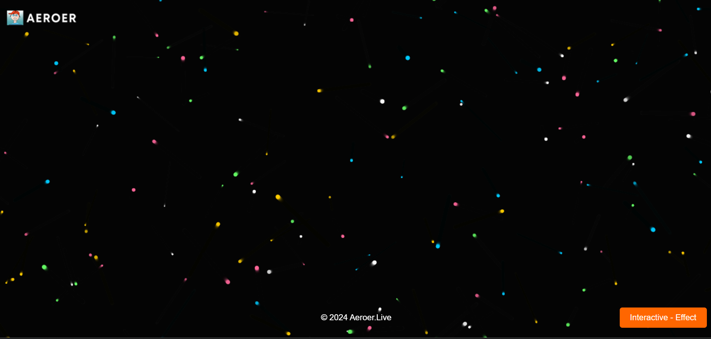
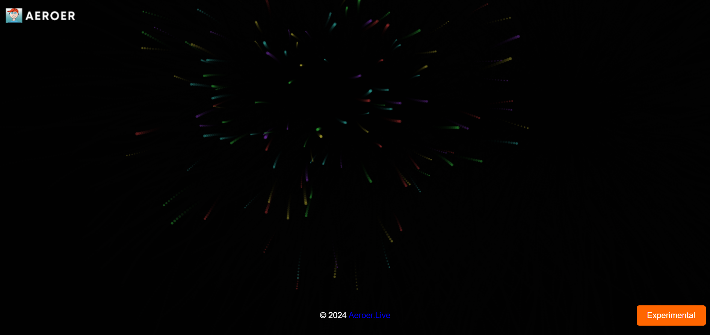
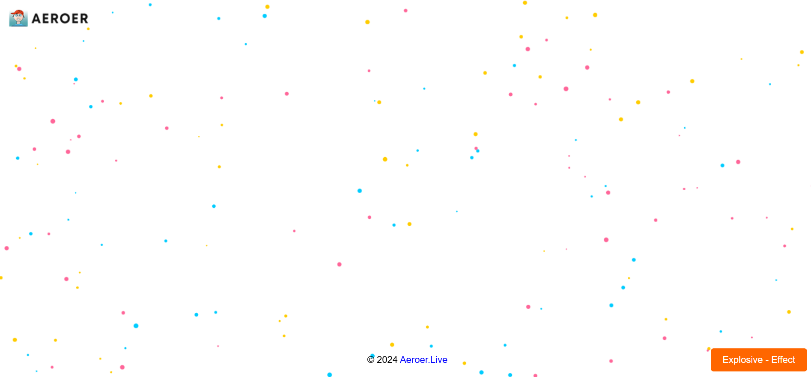

This particle effect ✨ is a stunning visual feature designed to enhance website backgrounds with dynamic, interactive elements. Created using a combination of HTML, CSS, and JavaScript, it adds a touch of creativity and sophistication to any web page. Whether you're aiming to captivate visitors with animated sparkles or bring a sense of interactivity to your site, this effect is a perfect choice. 💥🚀 Its lightweight code ensures smooth performance while maintaining visual appeal, making it an excellent addition for modern web designs.

 

 

 

